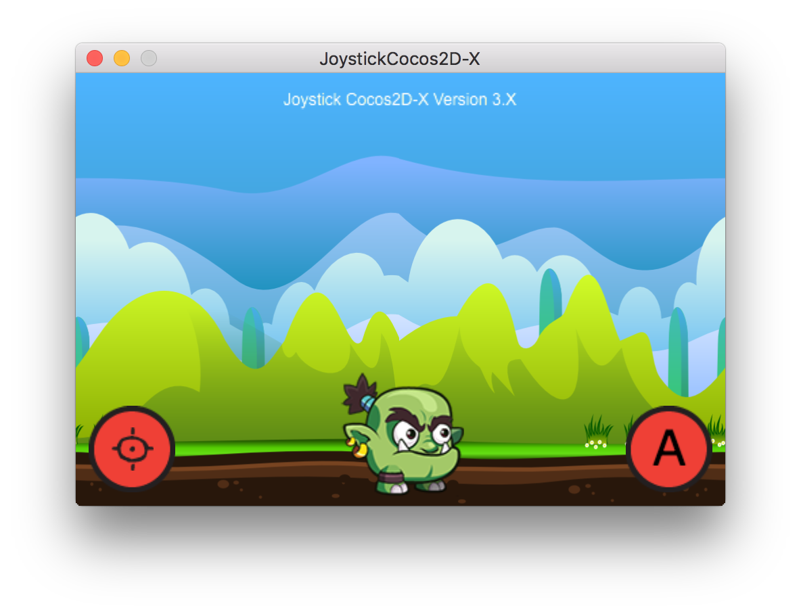

Support with donation
=====================

JoystickCocos2D-X
===============

Small example to use virtual Joystick with Cocos2D-X 3

Features
===============

1 - Converted SneakyInput converted to Cocos2D-X version 3

2 - Working project that make use of new components from Cocos2D-X version3

3 - Working version for: iOS, OSX and Android

TODO
===============

1 - Create a class Player that extends from Sprite (dont need show a real sprite, can be a box) and make it answer to events (move with joystick and jump with action button)

2 - Make the multi-resolution work. I tried it but dont work. In the project i have partial code on AppDelegate.

3 - Make the joystick support or enable the multi-touch events. I think that it already have, but i dont know in the version 3 of Cocos2d-X where is the method that enable it.

4 - Make the scene have a ground and a wall in both sides to create a limit for player move (they will be transparent using box2d).

5 - Make a camera that follow the player movement.

6 - Make the player jump with box2d and move with box2d. His movements will be limited by the ground and the walls. The walls distance can be larger than screen (480x320).

7 - Make a simple menu scene (in separated class) with a button START GAME that change to game scene 

GOAL
===============

Make a real simple game that have a player, a scene that the player can move using box2d to move and jump. 

The scene will have a limit to player movements, a ground and two box on each side to make the player stop walk when reach this walls(box2d boxes).

The camera will follow the player to both sides whe it walk.

We need a parallax effect too in background and some sounds to jump.

With this, anyone can start your project and study the basic concepts.

Screenshot
===============

Credits
================

Created by Paulo Coutinho - paulo(at)prsolucoes(dot)com

Thanks.
