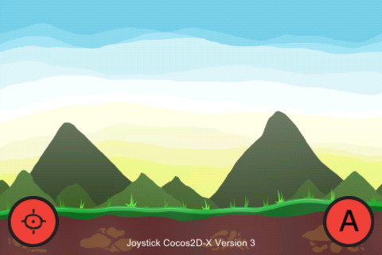

JoystickCocos2D-X
===============

Small example to use virtual Joystick with Cocos2D-X 3

Features
===============

1 - Converted SneakyInput converted to Cocos2D-X version 3

2 - Working project that make use of new components from Cocos2D-X version3

3 - Working version for: iOS, OSX and Android

4 - Can you add a new feature? Like a box2d simple crate that answer to events (move with joystick and jump with action button)?

I dont know ho to enable mult-touch on version 3 of Cocos2D-X, if you know, make a pull request please.

Screenshot
================

Credits
================

Colaborated by Paulo Coutinho - paulo(at)prsolucoes(dot)com

Thanks.
